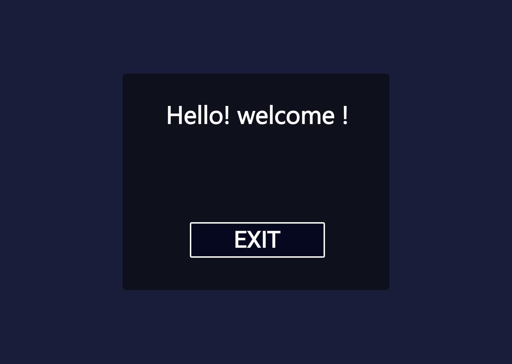
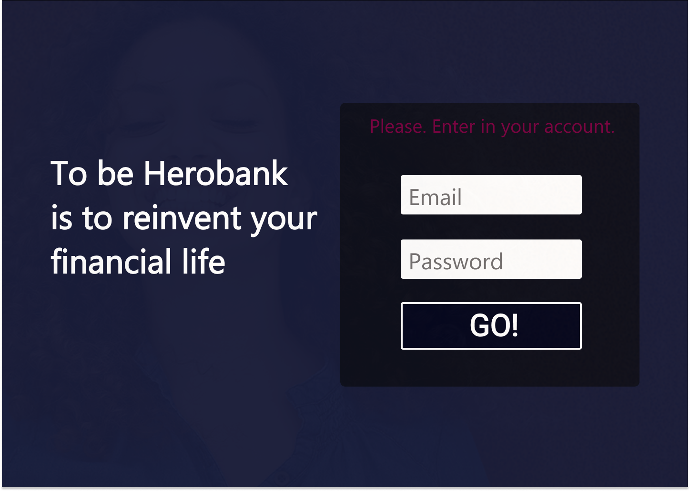

### Herobank

**Um sistema básico até o momento onde o usuário se cadastra e seus dados ficarão guardados no banco de dados. Logo em seguida ele terá a opção de clicar num botão para voltar ao login.**

- Backend: Node
- Front-end: React
- Designer: Figma

#### Observações

*A finalidade desse programa é ter testes unitários, conexão do front e backend, Por favor, Caso queira saber mais sobre as ferramentas usadas para esses projeto, verificar o package.json*

#### Como Iniciar 

```
npm i  
```

#### Como iniciar o server

```
npx nodemon api/index.js  
```

#### Como iniciar o Front
```
npm start  
```

#### Rascunhos feito no Figma

<p float="left">
    
     
</p>

Em desenvolvimento com muito carinho por: Luiz Lima